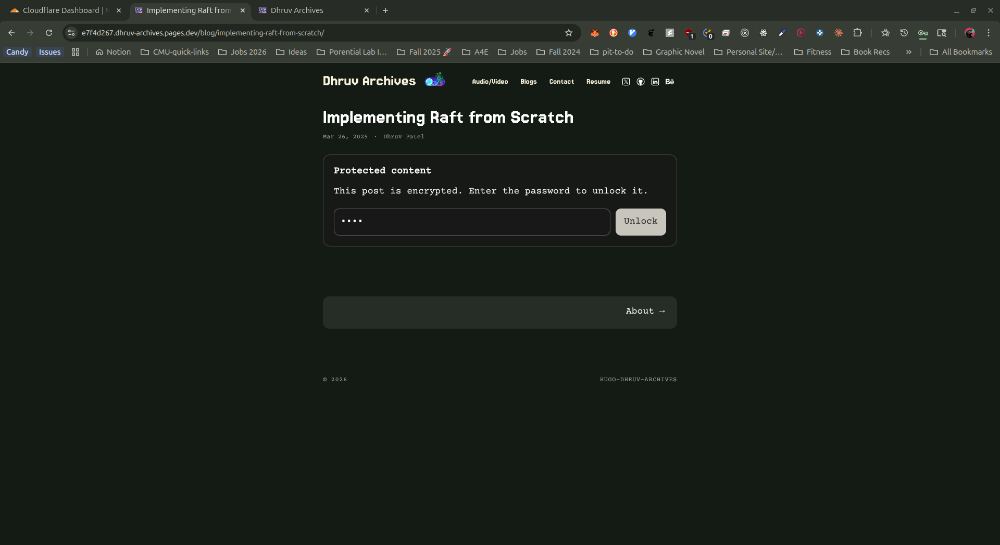

# Hugo Dhruv Archives Theme

Custom Hugo theme for [dhruv-archives.com](https://dhruv-archives.com) with modular, param-driven customization and a redesigned homepage UI.


## My Bits and Bobs

First, the philosophy. Most customizations are exposed as `params.*` in your `hugo.toml` so the theme stays modular.

- Modular typography + font loading via Hugo params + Google Fonts (`heading_*`, `body_*`, `google_fonts`) (compiled into CSS variables via `assets/font-variables.css`)
- Responsive homepage featured "postcard" area (fluid across devices) with random portrait/landscape media from (//TO-DO: Can make croping dynamic and dark, bright mask logic easier):
  - `static/animation/golden-portrait/`
  - `static/animation/golden-landscape/`
- Homepage intro blocks via `params.aboutItems`
- Animated theme toggle with custom assets (`/static/button/*.webp`)
- Flexoki-inspired light/dark background palette controlled by `params.color`
- Grid-style post listing on list/home pages
- [Private / Protected Posts (Optional)](#private--protected-posts-optional): build-time encryption + in-browser unlock UI (see section below)

## Screenshots

The images in `./images/` are snapshots and may not match your latest local changes.

Latest (images/new/):

Protected content gate:



Homepage (mobile):


Homepage (desktop):


Homepage (mobile, alt):


Snapshot (light):


Snapshot (dark):


## Install

As a git submodule:

```bash
git submodule add https://github.com/dhruv0000/hugo-dhruv-archives-theme themes/hugo-dhruv-archives
```

Then in your `hugo.toml`:

```toml
theme = "hugo-dhruv-archives"
```

Run:

```bash
hugo server
```

## Config Template

Copy/paste and tweak:

```toml
theme = "hugo-dhruv-archives"
baseURL = "https://example.com/"
languageCode = "en-us"
title = "Your Site Title"

[params]
  # which sections count as "posts" (affects home + prev/next nav)
  mainSections = ["blog"]

  # valid: linen, wheat, gray, light
  color = "linen"

  # fonts (optional)
  google_fonts = [
    ["Jersey 15", "400"],
    ["Courier Prime", "400,700"]
  ]

  heading_font = "Jersey 15"
  heading_weight = "400"
  body_font = "Courier Prime"
  body_weight = "400,700"
  body_h_weight = "700"

  # social (optional)
  github = "YOUR_GITHUB_ID"
  twitter = "YOUR_TWITTER_ID"
  linkedin = "YOUR_LINKEDIN_ID"
  behance = "YOUR_BEHANCE_ID"
  rss = true

  # icons (optional)
  favicon = "favicon.ico"
  appleTouchIcon = "apple-touch-icon.png"

  [[params.aboutItems]]
    title = "./whoami"
    description = "Short blurb for the homepage."

[menu]
  [[menu.main]]
    identifier = "blog"
    name = "Blog"
    url = "/blog/"
    weight = 10
```

## Additional Supported Params (From old template)

```toml
[services]
  [services.disqus]
    shortname = "YOUR_DISQUS_SHORTNAME"

[params]
  # social icons rendered in header:
  # twitter, github, instagram, linkedin, mastodon, threads, bluesky, behance, rss
  mastodon = "https://mastodon.instance/@you"
  threads = "@your_handle"
  bluesky = "your-handle.bsky.social"
  rss = true

  # profile card
  avatar = "email@example.com" # or image URL
  name = "Your Name"
  bio = "Your bio"

  # behavior
  disableHLJS = true
  disablePostNavigation = true
  monoDarkIcon = true
  gravatarCdn = "https://cdn.v2ex.com/gravatar/"
  math = true
  localKatex = false
  graphCommentId = "YOUR_GRAPHCOMMENT_ID"
  direction = "rtl"

  [params.giscus]
    repo = "owner/repo"
    repoId = "..."
    category = "General"
    categoryId = "..."
    mapping = "pathname"
    strict = "1"
    reactionsEnabled = "0"
    emitMetadata = "0"
    inputPosition = "top"
    theme = "light"
    lang = "en"
    loading = "lazy"
```

Front matter:

```toml
comments = false
math = true
mermaid = true
```

## Private / Protected Posts (Optional)

This theme supports password-protected pages intended for:

- Unfinished drafts you want to publish later
- Private diary entries
- Personal notes / study notes
- "Friends-only" writeups (shared password)

How it works (static-site friendly):

- At build time, your rendered post HTML is encrypted and replaced with a small unlock form + encrypted payload.
- At runtime (in the browser), readers enter the password to decrypt and render the post.

Important limitations:

- This is not server-side authentication. The encrypted payload is public and can be downloaded.
- A weak password can be brute-forced offline. Use a strong password and do not treat this as high-stakes secrecy.

### What The Theme Includes

- Runtime decrypt + unlock UI: `static/content-protection.js`
- Build-time encryptor reference: `themes/hugo-dhruv-archives/tools/protect-content.mjs`
- Unlock styles: `assets/custom.css` (protected-content-* classes)
- Single page content slot: `layouts/_default/single.html` (`id="protected-content-slot"`)
- Script include: `layouts/partials/head.html` (loads `content-protection.js` on pages)

### What You Add In Your Site Repo

For a private Hugo blog setup, keep your content/site repo private and keep this theme public.
Run the encryptor in your build pipeline so selected folders are shipped as encrypted payloads.
This lets you publish unfinished blogs, diary pages, or personal notes behind a password prompt.

1. Add a build step after Hugo:
   (If you deploy on Cloudflare Pages, set these env vars in Variables and Secrets for the matching environment.
   Preview branch deployments use Preview vars, and your production branch uses Production vars.
   Redeploy after variable changes so the build picks them up.)

```bash
hugo --minify
node themes/hugo-dhruv-archives/tools/protect-content.mjs
```

2. Set one or more folder passwords via env vars (paths are relative to your site's `content/`):

```bash
# Protect all posts under content/blog/
CONTENT_PASSWORD__BLOG=change-this-password

# Protect only content/diary/
CONTENT_PASSWORD__DIARY=change-this-password

# Protect only content/primer/
CONTENT_PASSWORD__PRIMER=change-this-password

# Optional: KDF work factor (default is 600000)
CONTENT_PROTECTION_PBKDF2_ITERATIONS=600000
```

Env var mapping rules:

- `CONTENT_PASSWORD__BLOG__MY_POST=...` maps to `content/blog/my-post/` (`__` -> `/`, `_` -> `-`)
- If both a parent folder and a more specific folder are set, the more specific one wins.

Crypto choice:

- PBKDF2-HMAC-SHA256 + AES-256-GCM (WebCrypto in-browser).
- Random 16-byte salt + random 12-byte IV per page.

Sources:

- OWASP Password Storage Cheat Sheet: https://cheatsheetseries.owasp.org/cheatsheets/Password_Storage_Cheat_Sheet.html
- MDN SubtleCrypto.deriveKey (PBKDF2/AES-GCM): https://developer.mozilla.org/en-US/docs/Web/API/SubtleCrypto/deriveKey
- MDN AesGcmParams (IV requirements): https://developer.mozilla.org/en-US/docs/Web/API/AesGcmParams

## Credits

Built on top of [hugo-paper](https://github.com/nanxiaobei/hugo-paper).

## License

[MIT](./LICENSE) (c) [Dhruv Patel](https://dhruv-archives.com/)
